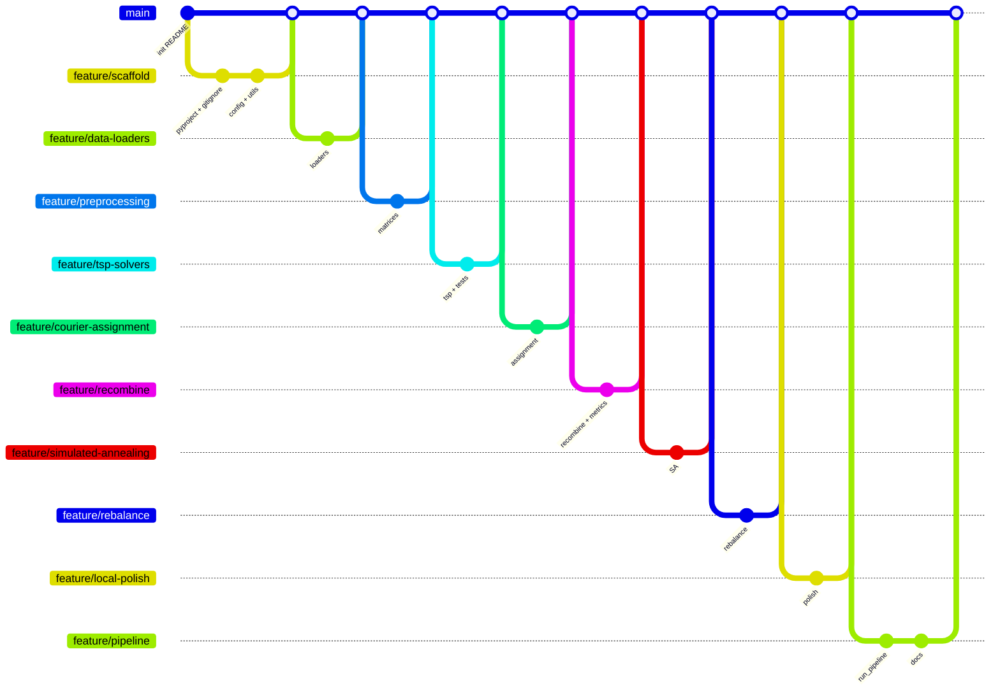

# Git workflow: ветки и коммиты

Документ описывает **целевую** историю репозитория после разбиения ноутбука.  
Все изменения уже собраны в рабочем дереве; ниже — как оформить их отдельными коммитами.

## Стратегия

- **Trunk:** `main` — всегда запускаемый минимум (после merge `feature/pipeline`).
- **Feature-ветки** — одна логическая область = одна ветка, 1–3 коммита.
- **Merge:** только `--no-ff`, чтобы сохранить ветки в графе.
- **Данные** в git не коммитятся (см. `.gitignore`).

## Диаграмма



## Пошагово

### 0. Инициализация

```bash
cd Route-Optimization-and-Local-Tendering
git init
git checkout -b main
```

### 1. `feature/scaffold`

```bash
git checkout -b feature/scaffold
git add pyproject.toml requirements.txt .gitignore optimization/config/ optimization/utils/logger.py optimization/utils/timing.py optimization/__init__.py
git commit -m "chore: add pyproject.toml, requirements.txt and .gitignore"
git add optimization/config/config.py optimization/models/__init__.py data/ output/
git commit -m "feat: add Config and project directory layout"
git add optimization/utils/__init__.py
git commit -m "feat: add logging and timing utilities"
git checkout main
git merge --no-ff feature/scaffold -m "Merge branch 'feature/scaffold'"
```

### 2. `feature/data-loaders`

```bash
git checkout -b feature/data-loaders
git add optimization/loaders/ scripts/build_distances.py
git commit -m "feat(loaders): add order, courier and distance loaders"
git checkout main
git merge --no-ff feature/data-loaders
```

### 3. `feature/preprocessing`

```bash
git checkout -b feature/preprocessing
git add optimization/preprocessing/
git commit -m "feat(preprocessing): add mappings, matrices and cross-memmap"
git checkout main
git merge --no-ff feature/preprocessing
```

### 4. `feature/tsp-solvers`

```bash
git checkout -b feature/tsp-solvers
git add optimization/solvers/tsp_solver.py optimization/solvers/__init__.py tests/
git commit -m "feat(solvers): add Christofides TSP and import smoke tests"
git checkout main
git merge --no-ff feature/tsp-solvers
```

### 5. `feature/courier-assignment`

```bash
git checkout -b feature/courier-assignment
git add optimization/models/courier.py optimization/models/route.py optimization/solvers/courier_assignment.py
git commit -m "feat(solvers): add initial polygon-to-courier assignment"
git checkout main
git merge --no-ff feature/courier-assignment
```

### 6. `feature/recombine`

```bash
git checkout -b feature/recombine
git add optimization/solvers/recombine.py optimization/utils/metrics.py optimization/utils/persistence.py
git commit -m "feat: add route recombination, metrics and persistence"
git checkout main
git merge --no-ff feature/recombine
```

### 7. `feature/simulated-annealing`

```bash
git checkout -b feature/simulated-annealing
git add optimization/solvers/rebalancer.py optimization/solvers/simulated_annealing.py
git commit -m "feat(solvers): add rebalancer and simulated annealing"
git checkout main
git merge --no-ff feature/simulated-annealing
```

### 8. `feature/rebalance`

```bash
git checkout -b feature/rebalance
git add optimization/solvers/rebalance.py
git commit -m "feat(solvers): add fast courier rebalance"
git checkout main
git merge --no-ff feature/rebalance
```

### 9. `feature/local-polish`

```bash
git checkout -b feature/local-polish
git add optimization/solvers/local_polish.py
git commit -m "feat(solvers): add order-level local polish"
git checkout main
git merge --no-ff feature/local-polish
```

### 10. `feature/pipeline`

```bash
git checkout -b feature/pipeline
git add optimization/pipeline/ README.md docs/
git commit -m "feat(pipeline): add run_pipeline CLI and documentation"
git checkout main
git merge --no-ff feature/pipeline
```

## Альтернатива: один squash-merge

Если нужна короткая история на `main`:

```bash
git checkout main
git merge --squash feature/pipeline
git commit -m "feat: modular route optimization pipeline from notebook"
```

## Теги релизов (опционально)

| Тег | Содержание |
|-----|------------|
| `v0.1.0` | assignment + recombine |
| `v0.2.0` | + SA + rebalance |
| `v0.3.0` | + local polish + CLI |
